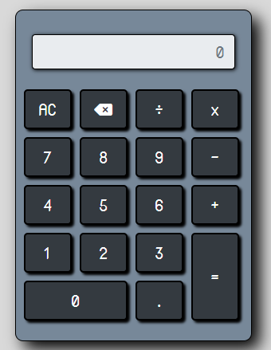

# Calculadora Frontend
## Sprint Final Módulo 2

## Integrantes
Gustavo Ruiz, Jorge Moraga, Juan Pino

Este proyecto está generado con html, css y javascript

## Como Ejecutar y configurar el Proyecto

 Para ejecutar la calculadora, debes seguir los siguientes pasos:

 1. Clonar el repositorio en su computadora (https://github.com/Gustavoruizsaumon/calculadora.frontend.git)
 2. O también descargar el proyectio en formato .zip (https://github.com/Gustavoruizsaumon/calculadora.frontend/archive/refs/heads/main.zip)
 3. Abrir el archivo calculadora.html en el navegador de su preferencia.
 4. También puede abrir el proyecto en Visual Studio Code y arrancar calculadora.html con Live Server.

## Contribuyendo

1. Si desas contribuir a este proyecto puedes hacer un fork del repositorio y enviar tu pull request con tus cambios.
   Estaremos encantados de revisar tus contribuciones y trabajar contigo para mejorar este proyecto. 

## Requisitos
Requisitos Funcionales:
   1. Es capaz de realizar las operaciones matemáticas básicas.
   2. Permite a los usuarios limpiar la pantalla.
   3. Permite borrar número a número una cifra ingresada.

Requisitos No Funcionales:
   1. Debe ser de uso amigable e intuitivo.
   2. Debe ser confiable y exacta, produciendo los resultado pedidos.
   3. Es rápida y responsiva.
